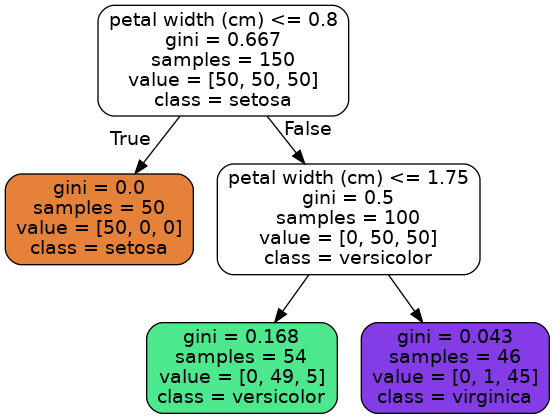

# Decision Tree

``` c
Decision Trees are fairly intuitive and their decisions are easy to interpret, such models are often called *white box models*, In contrast, random forests or neural networks are generally considered *black box models*
```

One of the many qualities of decision tree is that they require very little data preparation. **In particular, they don't require feature scaling or centering at all**.

## Datasets --- IRIS

```python
from sklearn.datasets import load_iris
from sklearn.tree import DecisionTreeClassifier
from sklearn.tree import export_graphviz

iris = load_iris()
X = iris.data[:, 2:]
y = iris.target
tree_clf = DecisionTreeClassifier(max_depth=2)
tree_clf.fit(X,y)
export_graphviz(tree_clf, 
                out_file="iris_tree.dot", 
                feature_names=iris.feature_names[2:],
                class_names=iris.target_names,
                rounded=True,
                filled=True)
dot -Tpng iris_tree.dot -o iris_tree.png
```



A node's *value* attribute tells you how many training instances of each class this node applies to.

A node's *gini* attribute measures tis impurity.
$$
G_i = 1 - \sum_{k=1}^N{p_{i,k}^2}
$$
$p_{i,k}$ is the ratio of class $k$ instances among the training instances in the $i^{th}$ node.

the method of decision tree classifier 

## CART

- *Classification And Regression Tree*
- scikit-learn uses the CART algorithm, which produces only *binary tree*

**Cost function**:
$$
J(k,t_k) = {m_{left}  \over m}G_{left} + {m_{right}  \over m}G_{right}
$$
where, G~left~ / G~right~ measures the impurity of the left/right subsets, m~left~ / m~right~ is the number of instances in the left/right subset.

Once is has successfully split the training set in two, it splits the subsets using the same logic, then the sub-subsets and so on, **recursively**. It stops recursing once is reaches the maximum depth (defined by the max_depth hyperparameter), or if it cannot find a split that will reduce impurity.

Actually, the CART algorithm is a **greedy algorithm**: it greedily searches for an optimum split at the top level, then repeats the process at each level. It does not check whether or not the split will lead to the lowest possible impurity several levels down. A greedy algorithm often produces a reasonably good solution, but it is not guaranteed to be the optimal solution.

## Regularization Hyperparameters

A model is called a *nonparametric model*, not because it doesn't have any parameters (it often has a lot) but because the number of parameters is not determined prior to training, so the model structure is free to stick closely to the data. In contrast, a *parametric model* such as linear model has a predetermined number of parameters, so its degree of freedom is limited, reducing the risk of overfitting (but increasing the risk of underfitting).

## Limitation

1. Decision Trees love orthogonal decision boundaries (all splits are perpendicular to an axis), which makes them sensitive to training set rotation.

   

   One way to limit this problem is to use PCA, which often results in a better orientation of the training data.

2. Sensitive to small variations in the training data.

   Random Forests can limit this instability by averaging predictions over many trees.

## Exercises

1. what is the approximate depth of a Decision Tree trained (without restriction) on a training set with a million instances?

   20

2. 


