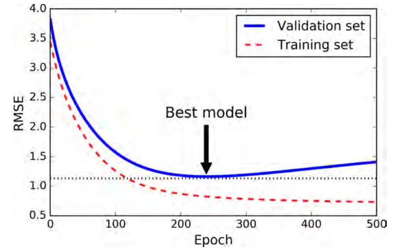

[TOC]

# Model

## model creation
start from **Input**, chain layer calls to specify the model's forward pass, and finally create the model from inputs and outputs.

```python
# MLP
input = tf.keras.Input(shape(None, 16))
x = tf.keras.layers.Dense(4, activation=tf.keras.activation.relu)(input)
output = tf.keras.Dense(2, activation = tf.keras.activation.softmax)(x)
# specify the input tensor and output tensor here. then a complete model is established.
model = tf.keras.Model(inputs = input, outputs=output)
```
Moreover, the parameter `inputs` and `outputs` of `Model` class can cover more than one `Input/output`. The following model is from github project *rnnoise*:

```python
from tensorflow.keras.layers import Input, Dense, GRU
from tensorflow.keras.models import Model
from tensorflow.kears.layers import concatenate
model_input = Input(shape=(None,42), name='model_input')
x = Dense(24, activation='tanh')(model_input)
vad_gru = GRU(24)(x)
vad_out = Dense(1)(vad_gru)
denoise_input = concatenate([x, vad_gru, model_input])
denoise_gru = GRU(96)(denoise_input)
denoise_output = Dense(22)(denoise_gru)
model = Model(inputs=model_input, outputs=[vad_out, denoise_output])
```

The above example has two output: `vad_out` and `denoise_output`, which can be considered that two models have been created at the same time and share part of the overall models with each other.


In addition to the `concatenate`, there are some other layers/functions to do merging of tensor objects.

```python
from tensorflow.keras import layers as K
import tensorflow as tf
x = tf.constant([[1,2],[3,4]])
y = tf.constant([[5,-1],[7,3]])
# Add layer or add function
K.add([x,y])
K.Add()([x,y])
```

## model.compile

```python
complie(
    optimizer,
    loss=None,
    metrics=None,
    loss_weights=None,
    ...
)
```
Here, parameter 

- `optimizer` should be a string (name of optimizer, predefined in Keras, such as, 'adam' ) or optimizer instance, such as `tf.keras.optimizers.Adam(lr=0.0001)`

- `loss` should be a string (name of objective function, such as `categorical_crossentropy`) or custom function.

  ```python
  from tensorflow.keras import backend as K
  # the arguments y_true and y_pred are tensors, should always be used as positional paramter.
  def my_crossentropy(y_true, y_pred):
      return K.mean(2*K.abs(y_true-0.5) * K.binary_crossentropy(y_pred, y_tue), axis=-1)
  ```

  if the model has multiple outputs, you can use a different loss function on each output by passing a dictionary or a list of losses.

  ```python
  model.compile(loss = ['categorical_crossentropy', my_crossentropy],
                metric = getMetrics(),
                optimizer = ['Adam', 'otherone'],
                loss_weights = [10, 0.5])
  ```

  

- `metrics` should be a list of metrics to be evaluated by the model during training and testing phase.

  ```python
  # no need to pass arguments to function getMetrics.
  def getMetrics():
      def accuracy(y_true, y_pred):
          return KB.cast(KB.equal(KB.argmax(y_true, axis=-1), 
                                  KB.argmax(y_pred, axis=-1)), 
                         KB.floatx())
      def false_positive(y_true, y_pred):
          return y_pred[:, 1]*y_true[:, 0]
      def false_negative(y_true, y_pred):
          return y_pred[:, 0]*y_true[:, 1]
      def true_positive(y_true, y_pred):
          return y_pred[:,1]*y_true[:,1]
      def precision(y_true, y_pred):
          tp = KB.sum(true_positive(y_true, y_pred))
          fp = KB.sum(false_positive(y_true, y_pred))
          return tp/(tp+fp)
      def recall(y_true, y_pred):
          tp = KB.sum(true_positive(y_true, y_pred))
          fn = KB.sum(false_negative(y_true, y_pred))
          return tp/(tp+fn)
      return [accuracy, precision, recall]
  ```

- `loss_weights` ???? don't understand yet.

## model.fit

```python
fit(
    x,
    y,
    batch_size = None,
    epochs = 1,
    callbacks = None,
    validation_split = 0.0,
    validataion_data = None,
    shuffle = True,
    steps_per_epoch = None,
    validation_steps = None,
    ...
)
```

Parameters here,

- `x, y` input data and target data respectively. if a `tf.data` dataset or dataset iterator is used, which returns a tuple of (inputs, targets), `y` should not be specified.
- `shuffle` Boolean (whether to shuffle the training data before each epoch). Has no effect when `steps_per_epoch` is not `None`.

## model.evaluate

```python
evaluate(X, y)
```

return the loss value and metrics values specified in `compile` procedure for the model in the test mode.

## model.predict

when predicting, the input to feeded to model shall be preproceessed, such as dimension, normalization, like in training.

## model.save

Saving model in this way includes everything we need to know about the model, including:

- model weights
- model architecture
- model compilation details (loss and metrics)
- model optimizer state

```python
"""
save a model to hdf5 file.
model -> keras model instance to be saved.
"""
tf.keras.models.save_model(
    model,
    filepath,
    overwrite=True,
    include_optimizer=True
)
# or
model.save(
	filepath,
	overwrite=True,
	include_optimizer=True)
"""
loads a model saved via save_model or save method of Model class.
filepath -> h5py file
compile -> If an optimizer was found as part of the saved model, the model is already compiled. Otherwise, the model is uncompiled and a warning will be displayed. When compile is set to False, the compilation is omitted without any warning.
"""
tf.keras.models.load_model(
    filepath,
    custom_objects=None,
    compile=True
)

```

`Keras` provides the ability to describe any model using JSON format with a `to_json()` function. This can be saved to file and later loaded via the `model_from_json()` function that will create  a new model from the JSON specification. The weights are saved directly from the model using the `save_weights()` function and later loaded using the symmetrical `load_weights()` function.

```python
model = Model(inputs=inputs, outputs=outputs)
model.compile(loss='binary_crossentropy', optimizer='adam', metrics=['accuracy'])
model.fit()
model_json = model.to_json()
with open("model.json","w") as json_file:
    json_file.write(model_json)
model.save_weights("model.h5")

# load json and create model
json_file = open("model.json","r")
loaded_model_json = json_file.read()
loaded_model = model_from_json(loaded_model_json)
loaded_model.load_weights("model.h5")
loaded_model.compile(loss='binary_crossentropy', optimizer='rmsprop', metrics=['accuracy'])
```

## model.reset_states

```python
model.reset_states()
```


# Loss function

## Built-in function

```python
# Aliases. 
# Defined in Keras.
mse = MSE = mean_squared_error
mae = MAE = mean_absolute_error
mape = MAPE = mean_absolute_percentage_error
msle = MSLE = mean_squared_logarithmic_error
kld = KLD = kullback_leibler_divergence
cosine = cosine_proximity

from tensorflow.keras import backend as K
def mean_squared_error(y_true, y_pred):
    return K.mean(K.square(y_pred - y_true), axis=-1)
def mean_abs_error(y_true, y_pred):
    return K.mean(K.abs(y_pred - y_true), axis=-1)
def hinge(y_true, y_pred):
    return K.mean(K.maximum(1. - y_true * y_pred, 0.), axis=-1)
def categorical_crossentropy(y_true, y_pred):
    return K.categorical_crossentropy(y_true, y_pred)

from tensorflow import keras as K

# target: tensor with the same shape as output
# from_logit: whether output is expected to be a logits tensor. 
# By default, output encodes a probability distribution.
K.backend.binary_crossentropy(target,
                             output,
                             from_logit=False)

K.backend.categorical_crossentropy(target, output, from_logit=False, axis=-1)
```

+ [ ] The difference between them ?

  `binary_crossentropy` function (call function `tf.nn.sigmoid_cross_entropy_with_logits` inside it) is for discrete classification tasks in which classes **are not mutually exclusive**. For instance, one could perform **multilabel classification** where a picture can contain both an elephant and a dog at the same time.

  `categorical_crossentropy` function (call function `tf.nn.softmax_cross_entropy_with_logits` inside it) is for discrete classification tasks in which the classes **are mutually exclusive** (each entry is in exactly one class). For example, each CIFAR-10 image is labeled with one and **only one label**: an image can be a dog or a truck, but not both.

## Customized function	

```python
from tensorflow.keras import backend as K
# most of functions in K are for element-wise operation.
def my_crossentropy(y_true, y_pred):
    return K.mean(2*K.abs(y_true-0.5) * K.binary_crossentropy(y_pred, y_true), axis=-1)
```

+ [ ] [Hinge loss](<https://en.wikipedia.org/wiki/Hinge_loss>)

  the hinge loss is used for 'maximum margin' classification, most notably for SVM.

  $l(y) = max(0, 1-t*y)$

- `sparse_softmax_cross_entropy_with_logits`  &  `softmax_cross_entropy_with_logits_v2`

```python
tf.nn.softmax_cross_entropy_with_logits_v2(labels, logits)
# `labels`: shape: [batch_size, num_classes],
#			each row of labels[i] must be a valid probability distribution.
# `logits`: unscaled log probabilities.

tf.nn.sparse_softmax_cross_entropy_with_logits(labels, logits)
# `labels`: shape: [batch_size,], each element must be an index in [0, num_classes]
# `logits`: unscaled log probabilities.
```


# Metrics

## Usage of metrics

A metric is a function that is used to judge the performance of your model. Metric functions are to be supplied in the metrics parameter when a model is compiled.

A metric function is similar to a loss function, except that the results from evaluating a metric are not used when training the model. You may use any of the loss functions as a metric function.

## Frequently used metrics

```python
def categorical_accuracy(y_true, y_pred):
    return K.cast(K.equal(K.argmax(y_true, axis=-1),
                         K.argmax(y_pred, axis=-1)), K.floatx())
```

# Optimizer

```python
# all classes of optimizer in keras
all_classes = {
    'sgd': SGD,
    'rmsprop': RMSprop,
    'adagrad': Adagrad,
    'adadelta': Adadelta,
    'adam': Adam,
    'adamax': Adamax,
    'nadam': Nadam,
    'tfoptimizer': TFOptimizer,
}
```

Optimizers defined in `Keras` are classes and each of class inherits from base class `Optimizer`, 


# Callbacks
## Lambda Callback
For creating simple, custom callbacks on-the-fly. This callback is constructed with anonymous functions that will be called at the appropriate time. Note that the callbacks expects positional arguments, as:

- on_epoch_begin and on_epoch_end expect two positional arguments: epoch, logs
- on_batch_begin and on_batch_end expect two positional arguments: batch, logs
- on_train_begin and on_train_end expect one positional argument: logs

## Early Stopping

```python
from tensorflow.keras import callbacks
callbacks.EarlyStopping(monitor='val_loss',
                       min_delta=0,
                       patience=20,
                       mode='min')
```

Interrupt training when **its performance on the validation set starts dropping**. Often, it's a good idea to use `val_loss` because it overfits much slower than training loss. This does however require that you add a `validation_split` in `model.fit`. `monitor` also can be set as `loss`, then the the `loss` will be computed on training set. 

As the epochs go by, the algorithm learns and its prediction error (RMSE) on the training set naturally goes down, and so does its prediction error on the validation set. However, after a while the validation error stops decreasing and actually starts to go back up. This indicates that the model has started to overfit the training data. With early stopping you just stop training as soon as the validation error reaches the minimum.



## Model Check Point

```python
callbacks.ModelCheckpoint(filepath,
                          monitor='val_loss',
                          save_best_only=False,
                          save_weights_only=False,
                          mode='auto',
                          period=1)
```

`save_best_only`: if `save_best_only=True`, the latest best model according to the quantity monitored will not be overwritten

`save_weights_only`: if True, then only the model's weights will be saved (`model.save_weights(filepath)`), else the full model is saved (`model.save(filepath)`)

Save the model after every epoch.

## Tensor board

used for visualizing graph and scalars and so on.

# Regularizer

```python
# defined in regularizers.py file.
class L1L2(Regularizer):
    ...
    def __call__(self, x):
        regularization = 0.
        if self.l1:
            regularization += self.l1 * K.sum(K.abs(x))
        if self.l2:
            regularization += self.l2 * K.sum(K.square(x))
        return regularization

def l1(l=0.01):
    return L1L2(l1=l)

def l2(l=0.01):
    return L1L2(l2=l)

def l1_l2(l1=0.01,l2=0.02):
    return L1L2(l1=l1,l2=l2)
```

If the value of parameter `l` is larger, then the regularization will be more powerful as larger value provide larger weight for regularization part in loss function.

# Constraint

```python
# defined in constraints.py file
import tensorflow.keras.backend as K
class MaxNorm(Constraint):
    def __init__(self, max_value=2, axis=0):
        self.max_value = max_value
        self.axis = axis
    def __call__(self, w):
        norms = K.sqrt(K.sum(K.square(w), axis=self.axis, keepdims=True))
        desired = K.clip(norms, 0, self.max_value)
        return w*(desired/(K.epsilon()+norms))

class NonNeg(Constraint):
    def __call__(self, w):
        return w * K.cast(K.greater_equal(w,0),K.floatx())
    
max_norm = MaxNorm
non_neg = NonNeg
unit_norm = UnitNorm
min_max_norm = MinMaxNorm
```

`Constraint` directly limit the value of weights by a specific rule. Unlike `Regularizer`, it is not added to loss function.


