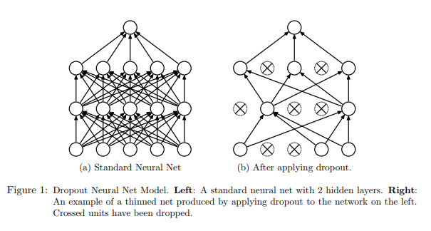

[TOC]

# Input Layer

```python
tf.keras.layers.Input(shape=None, batch_shape=None, name=None, dtype=None, sparse=None, tensor=None)
```

`Input()` is used to instantiate a Keras tensor. A Keras tensor is a tensor object from the underlying backend (Theano, TensorFlow or CNTK), which we augment with certain attributes that allow us to build a Keras model just by knowing the inputs and outputs of the model. 

For instance, if a, b and c are Keras tensors, it becomes possible to do:  `model = Model(input=[a, b], output=c)`

`shape`: A shape tuple (integer), not including the batch size. For instance, `shape=(32,)` indicates that the expected input will be batches of 32-dimensional vectors. 

`batch_shape`: A shape tuple (integer), including the batch size. For instance, `batch_shape=(10, 32)` indicates that the expected input will be batches of 10 32-dimensional vectors. `batch_shape=(None, 32)` indicates batches of an arbitrary number of 32-dimensional vectors. When DNN model contains **stateful** RNN layers (LSTM, GRU), `batch_shape` must be used to specify the batch size rather than `shape`.

```python
# create input layer for the input vector with 16 features, and batch size is not decided yet now.
model_input = tf.keras.layers.Input(shape=(None,16), name='model_input')
# equivalant to
model_input2 = tf.keras.layers.Input(shape=(16,), name='model_input')
# create input layer for the model which contains RNN layer
model_input = tf.keras.layers.Input(batch_shape=(batch_size, time_steps, feature_dims),
                                    name='model_input')
```

# Time Distributed Layer

```python
tf.keras.layers.TimeDistributed
```

`TimeDistributed` applies a **same** Dense operation to every timestep for a 3D tensor (batch_size, time_steps, input_size).

# RNN

## LSTM cell

LSTM is a **recurrent layer**, while `LSTMCell` is an object **used by LSTM layer** that contains the calculation logic for one step.
A recurrent layer contains a cell object. The cell contains the core code for the calculations of each step, while the recurrent layer commands the cell and performs the actual recurrent calculations.

Usually, people use LSTM layers in their code. Or they use RNN layers containing `LSTMCell`. Both things are almost the same. An LSTM layer is a RNN layer using an `LSTMCell`, as you can check out in the source code.

**About the number of cells**: Although it seems, because of its name, that `LSTMCell` is a single cell, it is actually an object that manages all the units/cells as we may think. In the same code mentioned, you can see that the units argument is used when creating an instance of `LSTMCell`.

## GRU


## Parameter

```python
tf.keras.layers.GRU(
	units,
	return_sequences=False,
	return_state=True,
	stateful=False)
```

- `stateful`

  [1](https://www.zhihu.com/people/zai-duo-yidian)

  [2](https://machinelearningmastery.com/understanding-stateful-lstm-recurrent-neural-networks-python-keras/)

- `return_sequences`

  return the full sequences or the last sequence.

  ```python
  input size: [batch_size, time_steps, input_feature_size]
  output size:
  # usually for sequence-to-sequence model.
  if True: [batch_size, time_steps, input_feature_size]
  # usually for classification task.
  if False: [batch_size, 1, input_feature_size]
  ```

- `return_state`

  whether to return the last state in addition to the output.


# CNN

## Flatten Layer
`tf.keras.layers.Flatten(data_format=None)`

Flattens the input. Does not affect the batch size.

```python
model = Sequential()
model.add(Conv2D(64, (3, 3),
                 input_shape=(3, 32, 32), padding='same',))
# now: model.output_shape == (None, 64, 32, 32)

model.add(Flatten())
# now: model.output_shape == (None, 65536)
```

## Convolutional Layer


## Pooling Layer

# Batch Normalization

Normalize the activations of the previous layer at each batch, i.e. applies transformation that maintains the mean activation close to 0 while the activation standard deviation close to 1. During training, the layer will keep track of statistics for each input variable and use them to standardize the data.

```python
from tensorflow.keras.layers import BatchNormalization
BatchNormalization(momentum=0.99,
                  center=True,
                  scale=True,
                  trainable=True)
```

Argument "momentum" allows you to control how much of the statistics from the previous mini batch to include when the update is calculated. The standardized output can be scaled using the learned parameters of *Beta* and *Gamma* that define the new mean and standard deviation for the output of the transform. The layer can be configured to control whether these additional parameters will be used or not via the "center" and "scale".

**At the end of training, the mean and standard deviation statistics in the layer at that time will be used to standardize inputs when the model is used to make a prediction.**

Use Before or After the Activation Function? If time and resources permit, it may be worth testing both approaches on your model and use the approach that results in the best performance.

The layer can be added to your model to standardize raw input variables or the outputs of a hidden layer.

Reference: [How to Accelerate Learning of Deep Neural Networks With Batch Normalization](https://machinelearningmastery.com/how-to-accelerate-learning-of-deep-neural-networks-with-batch-normalization/)

# Merge Layer

## concatenate

Functional interface to the `Concatenate` layer, A list of input tensors (at least 2) as input, and then return a tensor which is the concatenation of the inputs alongside axis `axis`.

## add

Functional interface to the `Add` layer, returns a tensor which is the sum of the inputs (at least 2).

```python
    import keras

    input1 = keras.layers.Input(shape=(16,))
    x1 = keras.layers.Dense(8, activation='relu')(input1)
    input2 = keras.layers.Input(shape=(32,))
    x2 = keras.layers.Dense(8, activation='relu')(input2)
    added = keras.layers.add([x1, x2])

    out = keras.layers.Dense(4)(added)
    model = keras.models.Model(inputs=[input1, input2], outputs=out)
```

## multiply

Functional interface to the `Multiply` layer, returns a tensor which is the element-wise product of the inputs (at least 2).

# Core Layer

## Dropout

`tf.keras.layers.Dropout(rate, noise_shape=None, seed=None)`

rate: fraction of the input units to drop.



Using dropout regularization randomly disables some portion of neurons in a hidden layer. In the Keras library, you can add dropout after any hidden layer, and you can specify a dropout rate, which determines the percentage of disabled neurons in the preceding layer. In the original paper that proposed dropout layers, by [Hinton (2012)](https://arxiv.org/pdf/1207.0580.pdf), dropout (with p=0.5) was used on each of the fully connected (dense) layers before the output; it was not used on the convolutional layers. This became the most commonly used configuration.

[A Gentle Introduction to Dropout for Regularizing Deep Neural Networks](https://machinelearningmastery.com/dropout-for-regularizing-deep-neural-networks/)

"We used probability of retention p = 0.8 in the input layers and 0.5 in the hidden layers. Max-norm constraint with c = 4 was used in all the layers."

"It is common for larger networks to more easily overfit the training data. When using dropout regularization, it is possible to use larger networks with less risk of overfitting. A good rule of thumb is to divide the number of nodes in the layer before dropout by the proposed dropout rate and use that as the number of nodes in the new network that uses dropout. For example, a network with 100 nodes and a proposed dropout rate of 0.5 will require 200 nodes (100 / 0.5) when using dropout."

[How to use Dropout with LSTM Networks for Time Series Forecasting](https://machinelearningmastery.com/use-dropout-lstm-networks-time-series-forecasting/)

"It may be worth exploring the combination of both input and recurrent dropout to see if any additional benefit can be provided."

## Lambda

# Embedding Layer

Turns positive integers into dense vectors of fixed size.

```python
  model = Sequential()
  model.add(Embedding(1000, 64, input_length=10))
  # the model will take as input an integer matrix of size (batch,
  input_length).
  # the largest integer (i.e. word index) in the input should be no larger
  than 999 (vocabulary size).
  # now model.output_shape == (None, 10, 64), where None is the batch
  dimension.

  input_array = np.random.randint(1000, size=(32, 10))

  model.compile('rmsprop', 'mse')
  output_array = model.predict(input_array)
  assert output_array.shape == (32, 10, 64)
```


# Language Model

Estimate the probability of word sequence.

+ word sequence: w1, w2, w3, ..., wn
+ P(w1,w2,w3,...,wn)
+ application-1: speech recognition, different word sequences might have the same pronunciation.
+ application-2: sentence generation ...

## Traditional LM -- N-gram

how to estimate P(w1,w2,...,wn)?

+ collect a large amount of text data as training data, but the word sequence w1,w2,...,wn might not appear in the training data.
+ 2-gram LM:
  P(w1,w2,...,wn)=P(w1|START)P(w2|w1)...P(wn|wn-1).
  It is easy to generalize to 3-gram, 4-gram, ...

## NN-based LM