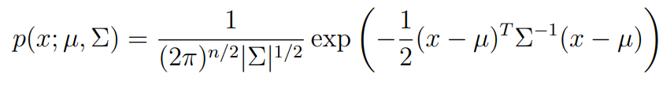

[toc]

# Gaussian (Normal) Distribution

## Univariate Gaussian Distribution

单变量正态分布的概率密度函数如下，

$$
p(x; \mu, \sigma^2) = \frac{1}{\sqrt{2\pi}\sigma} exp(-\frac{1}{2\sigma^2}(x-\mu)^2)
$$

指数函数的参数，$-\frac{1}{2\sigma^2}(x-\mu)^2$，是变量$x$的二次函数（quadratic function)，对变量$x$进行了归一化处理，此函数的曲线为抛物线并指向下方，存在且为唯一的最大值。$\frac{1}{\sqrt{2\pi}\sigma}$不依赖于变量$x$，用于使得概率密度函数的积分结果等于1.

## Multivariate Gaussian Distribution

多变量(多维)正态分布的概率密度函数如下，

指数函数的参数是向量$x$的二次函数形式，由于协方差矩阵$\Sigma$是**对称正定**的，并且任何正定矩阵的逆矩阵仍然是正定的，所以参数的结果是小于零的，且只有$x=\mu$时，参数的结果最大，为零。

## Covariance Matrix

随机变量X的方差定义如下，

$$
Var(X) = E[(X-E[X])(X-E[X])] = E[X^2] - E[X]^2
$$

随机变量X和Y的协方差定义如下，

$$
Cov(X,Y) = E[(X-E[X])(Y-E[Y])] = E[XY] - E[X]E[Y]
$$

协方差矩阵是由一个随机向量的各元素之间的方差/协方差组成的矩阵，定义如下，

$$
\Sigma = E[(X-\mu)(X-\mu)^T] = E[XX^T] - \mu\mu^T
$$

上式中的随机向量X和$\mu$是一个列向量。

# Gaussian Mixture Model

高斯混合模型是由K个高斯分布组成，每个高斯分布称为Component，K个component线性组合成为了GMM的概率密度函数

$$
p(x) = \sum_kp(x \bigcap k) = \sum_kp(k)p(x|k) = \sum_{k=1}^{k=K} \pi_kN(x;\mu_k,\Sigma_k)
$$

GMM可以用来完成聚类(clustering)任务，考虑一批无标签的训练数据，假设它们是由GMM生成或符合GMM分布，那么可以根据数据来推出GMM的概率分布，GMM的K个component实际上对应着K个cluster。根据数据来推算概率密度通常乘坐density estimation。当我们在已知或假定了概率密度函数的形式的情况下，估计其中的参数被称作“参数估计”。

基于一批数据，假设它们服从某个分布，现在要确定参数的值，例如，在GMM中，我们需要确定$p(k)$，$\mu_k$和$\Sigma_k$这些参数。想法是：找到一组参数，它所确定的概率分布使得给定的数据的出现的概率最大，这个概率等于$\prod_{i=1}^Np(x)$，我们把这个乘积称为似然函数，通常每个点的概率密度很小，所以对其求对数，乘积变成求和，得到对数似然函数。

> We wish to model the data by specifying a joint distribution $p(x(i), z(i)) =p(x(i)|z(i))p(z(i))$. Here, $z(i) ∼ Multinomial(φ)$ (where $φ_j ≥ 0$, $\sum_{j=1}^kφ_j = 1$,and the parameter $φ_j$ gives $p(z(i) = j)$), and $x(i)|z(i) = j ∼ N(µ_j, Σ_j)$. We let k denote the number of values that the $z^{(i)}$’s can take on. Thus, our model posits that each x(i) was generated by randomly choosing z(i) from {1, . . . , k}, and then x(i) was drawn from one of k Gaussians depending on z(i). This is called the mixture of Gaussians model. Also, note that the z(i)’s are latent random variables, meaning that they’re hidden/unobserved. This is what will make our estimation problem difficult.
>
> From CS229 Lecture notes, Andrew Ng.

## Multinomial Distribution

+ 伯努利分布

  即0-1分布，指一次随机试验，结果只有两种可能，随机变量X的取值为$X \in \lbrace 0, 1 \rbrace$.

  $X \thicksim B(1, p)$ 其中$p$表示一次伯努利实验中结果为1的概率。
  $$
  P(X=k \mid p) = (1-p)^{1-k} \times p^k \\
  E[X] = p \\
  Var[X] = p(1-p)
  $$
  

+ 二项式分布

  表示n次伯努利实验的结果，记为$X \thicksim B(n,p)$，其中$p$表示伯努利实验的结果为1的概率，随机变量X表示n次实验中结果为1的次数，即$X \in \lbrace0,1,2,3, ..., n \rbrace$。概率计算如下，
  $$
  P(X=k \mid n,p) = C_n^kp^k(1-p)^{n-k},  k = 0,1,2,3,...,n \\
  E[X] = n \times p \\
  Var[X] = np(1-p)
  $$

+ 多项式分布

  二项式分布的扩展，每次实验有n种结果。

  > When *k* is 2 and *n* is 1, the multinomial distribution is the [Bernoulli distribution](https://en.wikipedia.org/wiki/Bernoulli_distribution). When *k* is 2 and *n* is bigger than 1, it is the [binomial distribution](https://en.wikipedia.org/wiki/Binomial_distribution). When k is bigger than 2 and *n* is 1, it is the [categorical distribution](https://en.wikipedia.org/wiki/Categorical_distribution).
  >
  > The [Bernoulli distribution](https://en.wikipedia.org/wiki/Bernoulli_distribution) models the outcome of a single [Bernoulli trial](https://en.wikipedia.org/wiki/Bernoulli_trial). In other words, it models whether flipping a (possibly [biased](https://en.wikipedia.org/wiki/Fair_coin)) coin one time will result in either a success (obtaining a head) or failure (obtaining a tail). The [binomial distribution](https://en.wikipedia.org/wiki/Binomial_distribution) generalizes this to the number of heads from performing *n* independent flips (Bernoulli trials) of the same coin. The multinomial distribution models the outcome of *n* experiments, where the outcome of each trial has a [categorical distribution](https://en.wikipedia.org/wiki/Categorical_distribution), such as rolling a *k*-sided dice *n* times.
  >
  > From [Wikipedia: Multinomial distribution](https://en.wikipedia.org/wiki/Multinomial_distribution).

  

## EM Optimization

tbc.

# MLE and MAP

Maximum Likelihood Estimation

Maximum A Posteriori

[Bayesian Methods from UT Dallas](https://personal.utdallas.edu/~nrr150130/cs7301/2016fa/lects/Lecture_14_Bayes.pdf)

[Zhihu Xiafei answer](https://www.zhihu.com/search?type=content&q=MAP)

