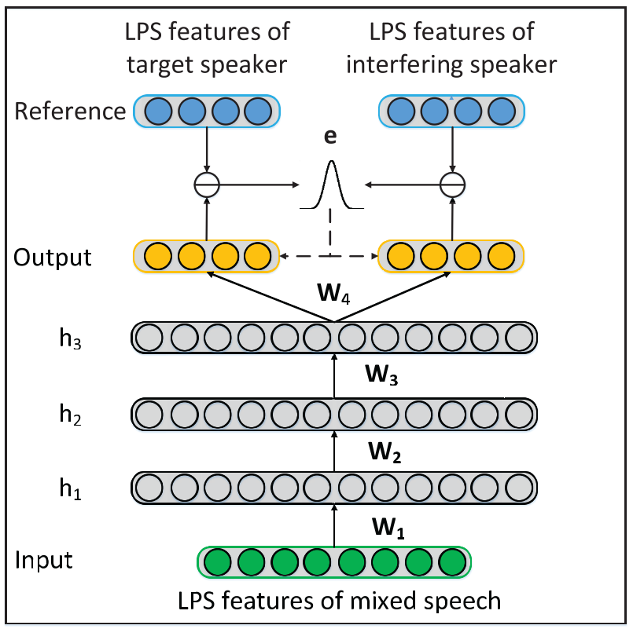

# Monaural Speech Separation

Speech separation is the task of separating a speech component of interest from speech segments mixed with multiple speakers while single-channel speech separation refers to the more challenging situation when only one microphone is avail- able for recording.

**A Maximum Likelihood Approach to Deep Neural Network Based Nonlinear Spectral Mapping for Single-Channel Speech Separation**

- Model structure

The input of DNN is the (2τ +1) D-dimensional log-power spectral (LPS) feature vector of mixed speech with an acoustic context of (2τ +1) neighboring frames while the dual output refers to a 2D-dimensional concatenation of two LPS feature vectors corresponding to the target speaker and the interfering speaker. The sigmoidal hidden units and linear output units are adopted.

We should indicate that the conventional MMSE-DNN is a special case of ML-DNN where the covariance matrix Σ in Eq. (5) is always an identity matrix, namely making a strong assumption that all the LPS components are with equal variances. This is the reason why MMSE optimization often leads to a poor generalization capability.

作者将真实值（对数功率谱，LPS）与预测值之间的预测误差作为随机向量，并假设它服从多变量高斯分布。对于给定的由数据对组成数据集和$(X,Y) = \lbrace (x_n,y_n)|n = 1,2,3,...,N \rbrace$，定义似然函数，并根据极大似然估计方法，来求解参数$\lbrace W,\Sigma\rbrace$

- How to train?

1. 分解对数似然函数公式后，可以看出最大化似然函数等效于最小化真实值与预测值之间的**马氏距离**，固定协方差矩阵的参数，然后利用minibatch gradient descent方法迭代优化DNN模型参数$W$；
2. 步骤一中在一轮(epoch)优化后固定参数**W**，并利用协方差矩阵的求解公式来更新协方差矩阵参数$\Sigma$；
3. 步骤一、二交替执行，来实现两组参数的优化。

+ Mahalanobis distance

马哈拉诺比斯距离，表示数据的协方差距离，可以定义为两个服从同一分布并且其协方差矩阵为$\Sigma$的随机变量x和y的差异程度：
$$
D_M(x,y) = \sqrt {(x-y)^T \Sigma^{-1} (x-y)}
$$
如果协方差矩阵为单位矩阵，那么马氏距离简化为欧式距离；如果协方差矩阵为对角矩阵，则称为正规化的欧式距离（standardized Euclidean distance）。

