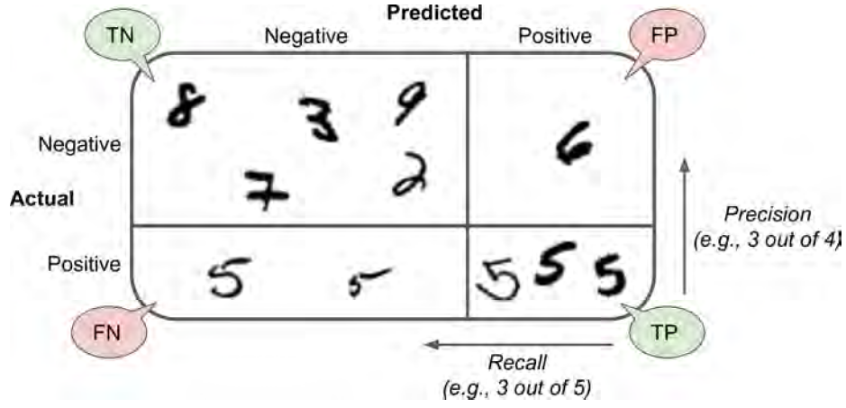
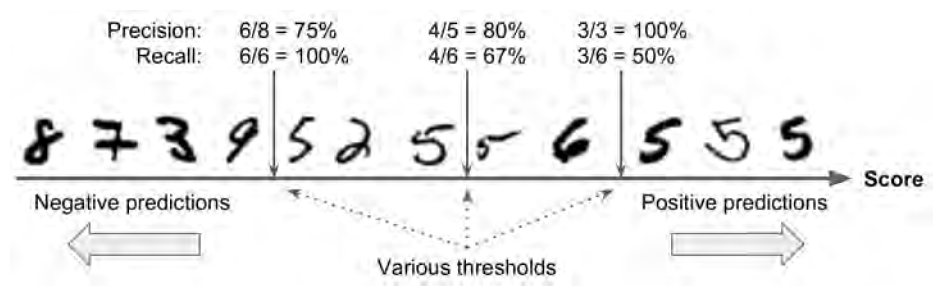

[TOC]

# Classification

## Dataset - MNIST

```python
from sklearn.datasets import fetch_openml
import numpy as np

mnist = fetch_openml(name='mnist_784')
X = mnist['data']
y = mnist['target']

X_train, X_test, y_train, y_test = X[:60000], X[60000:], y[:60000], y[60000:]
# shuffle the training set
shuffle_idx = np.random.permutation(60000)
X_train, y_train = X_train[shuffle_idx], y_train[shuffle_idx]
```

## Binary classification

```python
# 5-detector
y_train_5 = (y_train == '5')
y_test_5 = (y_test == '5')

# stochastic gradient descent (SGD) classifier
from sklearn.linear_model import SGDClassifier
# set seed of pseudo random number generator to use when shuffling the data
sgd_clf = SGDClassifier(random_state=42)
sgd_clf.fit(X_train, y_train_5)
sgd_clf.predict([X_test[0]])
sgd_clf.decision_function([X_test[0]])
```

`SGDClassifier`类包含的method有：

```python
# fit linear model with SGD
fit(self, X, y[, ...])
# predict class labels for sample x
predict(self, x)
# return the mean accuracy on the given test data and labels
score(self, X, y[, ...])
# predict confidence scores for sample x
decision_function(self, X)
```


## Performance measure

### cross-validation

**K-fold** 交叉验证意味着将训练集分成K份，然后在每K-1份fold上训练模型，并在剩下的一个fold上评估模型。

```python
from sklearn.model_selection import cross_val_score
sgd_clf = SGDClassifier(random_state=42)
cross_val_score(sgd_clf, X, y, cv=3)
```

### confusion matrix

对于二分类，混淆矩阵为2x2，它的每一行代表一个实际的类，比如数字识别，两个类别5和非5，第一行代表类别非5，第二行代表5。第一行第一列代表正确识别为非5的样本个数(true negatives, TN)，第一行第二列代表不是‘非5’被错误识别为非5的样本个数(false negatives, FN)。第二行第一列代表不是5（实际为非5）但被错误识别为5的样本个数(false positives, FP)，第二行第二列代表正确识别为5的样本个数(true positives, TP)。

一个好的混淆矩阵应该只在主对角线上有非零值。

常用的性能评估指标：

- Precision

  precision = TP / (TP + FP)

- Recall, sensitivity, true positives rate TPR

  recall = TP / (TP + FN)

- F~1~ score, combine the above two metrics

  F~1~ = 2 / (1/precision + 1/recall) = 2 * (precision * recall / (precision + recall))



```python
from sklearn.model_selection import cross_val_predict
from sklearn.metrics import confusion_matrix
from sklearn.metrics import precision_score, recall_score
from sklearn.metrics import f1_score

# cross_val_predict() function, like cross_val_score(), perfroms K-fold cross-validation, and returns the predictions made on each test fold instead of evaluation scores.
y_train_pred = cross_val_predict(sgd_clf, X_train, y_train_5, cv=3)
confusion_matrix(y_train_5, y_train_pred)
precision_score(y_train_5, y_train_pred)
recall_score(y_train_5, y_train_pred)
f1_score(y_train_5, y_train_pred)
```

`f1_score`偏爱性能指标precision和recall大小相似的分类器，然而这不一定是你想要的结果。有时，你更在意precision，希望它足够大，比如筛选出适合孩子观看的节目；有时，你希望recall足够大。precision和recall两个指标不能同时增大，一者的增大，会使得另一者减小，这被称为`precision/recall tradeoff`

### Precision/Recall tradeoff



```python
# specifing method as decision_function, then returned results are confidence scores for each sample.
y_scores = cross_val_predict(sgd_clf, X_train, y_train_5, cv=3, method="decision_function")
# with these confidence scores, precision and recall can be computed for all possible threshold.
from sklearn.metrics import precision_recall_curve
precision1, recall1, threshold1 = precision_recall_curve(y_train_5, y_scores)

def plot_them(precisions, recalls, thresholds):
    from matplotlib import pyplot as plt
    plt.plot(thresholds, precisions,"b--", label="Precision")
    plt.plot(thresholds, recalls, "g-", label="Recall")
    plt.xlabel("Threshold")
    plt.legend(loc="upper left")
    plt.show()
```

###  ROC curve

receiver operating characteristic

area under the curve AUC

```python
from sklearn.metrics import roc_curve
from sklearn.metrics import roc_auc_score
```

## Multinomial classification

二分类模型用于解决类别为2的分类问题；多类别分类模型可用于解决类别大于2的分类问题。部分模型，如随机森林分类器、朴素贝叶斯分类器，可以直接处理多类别分类问题。其他的模型，如SVM、线性分类器，是**严格**的二分类模型。然而，有各种策略可以实现使用多个二分类模型来解决多类别分类问题。

### one-versus-all (OvA) / one-versus-the-rest 

对于数字识别问题（10个数字），建立10个二分类模型，每个模型用于识别一个数字，训练完毕，预测某一测试用例的方法为10个分类器处理测试用例并返回各自的decision score，取最大score对应的结果为最终结果。


### one-versus-one (OvO) 

对于数字识别问题，建立45个二分类模型，每个模型用于识别一对数字，模型1：1和2，模型2：1，2，模型3：2和3......


`scikit-learn`检测到你在用二分类模型解决多分类问题时，会自动运行`OvA`策略（除了SVM，会使用`OvO`）。

```python
sgd_clf.fit(X_train, y_train)
# return 10 confidence scores corresponding to 10 binary classifier
sgd_clf.decision_function([X_test[0]])
print(sgd_clf.classes_)
```

如果你想使用两种策略中的一种，可以通过下面的方式：

```python
from sklearn.multiclass import OneVsOneClassifier
from sklearn.multiclass import OneVsRestClassifier

ovo_clf = OneVsOneClassifier(SGDClassifier(random_state=42))
ovo_clf.fit(X_train, y_train)
print(len(ovo_clf.estimators_))
```


## Multilabel classification

## Multi-output classification

