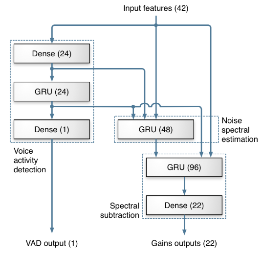

- [Model](#model)
  - [model creation](#model-creation)
    - [Model class](#model-class)
    - [Sequential class](#sequential-class)
  - [save/load model](#saveload-model)
  - [compile](#compile)
  - [fit](#fit)
- [Components](#components)
  - [Metrics](#metrics)
    - [Usage of metrics](#usage-of-metrics)
    - [Frequently used metrics](#frequently-used-metrics)
  - [Loss function](#loss-function)
  - [Optimizer](#optimizer)
  - [Callbacks](#callbacks)


# Model

## model creation
start from **Input**, chain layer calls to specify the model's forward pass, and finally create the model from inputs and outputs.

```python
# MLP
input = tf.keras.Input(shape(None, 16))
x = tf.keras.layers.Dense(4, activation=tf.keras.activation.relu)(input)
output = tf.keras.Dense(2, activation = tf.keras.activation.softmax)(x)
# specify the input tensor and output tensor here. then a complete model is established.
model = tf.keras.Model(inputs = input, outputs=output)
```
`Input()` layer is used to instantiate a *Keras tensor*, which is a tensor object from the underlying backend (Tensorflow or Theano), as the input layer of the overall model.

```python
# create input layer for the input vector with 16 features, and batch size is not decided yet now.
model_input = tf.keras.layers.Input(shape=(None,16), name='model_input')
# create input layer for the model which contains RNN layer
model_input = tf.keras.layers.Input(batch_shape=(batch_size, time_steps, feature_dims),
                                    name='model_input')
```

Moreover, the parameter `inputs` and `outputs` of `Model` class can cover more than one `Input/output`. The following model is from github project *rnnoise*:

```python
from tensorflow.keras.layers import Input, Dense, GRU
from tensorflow.keras.models import Model
from tensorflow.kears.layers import concatenate
model_input = Input(shape=(None,42), name='model_input')
x = Dense(24, activation='tanh')(model_input)
vad_gru = GRU(24)(x)
vad_out = Dense(1)(vad_gru)
denoise_input = concatenate([x, vad_gru, model_input])
denoise_gru = GRU(96)(denoise_input)
denoise_output = Dense(22)(denoise_gru)
model = Model(inputs=model_input, outputs=[vad_out, denoise_output])
```

The above example has two output: `vad_out` and `denoise_output`, which can be considered that two models have been created at the same time and share part of the overall models with each other.



In addition to the `concatenate`, there are some other layers/functions to do merging of tensor objects.

```python
from tensorflow.keras import layers as K
import tensorflow as tf
x = tf.constant([[1,2],[3,4]])
y = tf.constant([[5,-1],[7,3]])
# Add layer or add function
K.add([x,y])
K.Add()([x,y])
```


## save/load model
```python
"""
save a model to hdf5 file.
model -> keras model instance to be saved.
"""
tf.keras.models.save_model(
    model,
    filepath,
    overwrite=True,
    include_optimizer=True
)

"""
loads a model saved via save_model
filepath -> h5py file
compile -> If an optimizer was found as part of the saved model, the model is already compiled. Otherwise, the model is uncompiled and a warning will be displayed. When compile is set to False, the compilation is omitted without any warning.
"""
tf.keras.models.load_model(
    filepath,
    custom_objects=None,
    compile=True
)

```
## model.compile
```python
complie(
    optimizer,
    loss=None,
    metrics=None,
    loss_weights=None,
    ...
)
```
Here, parameter 

- `optimizer` should be a string (name of optimizer, predefined in Keras, such as, 'adam' ) or optimizer instance, such as `tf.keras.optimizers.Adam(lr=0.0001)`

- `loss` should be a string (name of objective function, such as `categorical_crossentropy`) or custom function.

  ```python
  from tensorflow.keras import backend as K
  # the arguments y_true and y_pred are tensors, should always be used as positional paramter.
  def my_crossentropy(y_true, y_pred):
      return K.mean(2*K.abs(y_true-0.5) * K.binary_crossentropy(y_pred, y_tue), axis=-1)
  ```

  if the model has multiple outputs, you can use a different loss function on each output by passing a dictionary or a list of losses.

  ```python
  model.compile(loss = ['categorical_crossentropy', my_crossentropy],
                metric = getMetrics(),
                optimizer = ['Adam', 'otherone'],
                loss_weights = [10, 0.5])
  ```

  

- `metrics` should be l list of metrics to be evaluated by the model during training and testing phase.

  ```python
  # no need to pass arguments to function getMetrics.
  def getMetrics():
      def accuracy(y_true, y_pred):
          return KB.cast(KB.equal(KB.argmax(y_true, axis=-1), 
                                  KB.argmax(y_pred, axis=-1)), 
                         KB.floatx())
      def false_positive(y_true, y_pred):
          return y_pred[:, 1]*y_true[:, 0]
      def false_negative(y_true, y_pred):
          return y_pred[:, 0]*y_true[:, 1]
      def true_positive(y_true, y_pred):
          return y_pred[:,1]*y_true[:,1]
      def precision(y_true, y_pred):
          tp = KB.sum(true_positive(y_true, y_pred))
          fp = KB.sum(false_positive(y_true, y_pred))
          return tp/(tp+fp)
      def recall(y_true, y_pred):
          tp = KB.sum(true_positive(y_true, y_pred))
          fn = KB.sum(false_negative(y_true, y_pred))
          return tp/(tp+fn)
      return [accuracy, precision, recall]
  ```

- `loss_weights` ???? don't understand yet.

## model.fit

```python
fit(
    x,
    y,
    batch_size = None,
    epochs = 1,
    callbacks = None,
    validation_split = 0.0,
    validataion_data = None,
    shuffle = True,
    steps_per_epoch = None,
    validation_steps = None,
    ...
)
```

Parameters here,

- `x, y` input data and target data respectively.

# Metrics

### Usage of metrics
A metric is a function that is used to judge the performance of your model. Metric functions are to be supplied in the metrics parameter when a model is compiled.

A metric function is similar to a loss function, except that the results from evaluating a metric are not used when training the model. You may use any of the loss functions as a metric function.

### Frequently used metrics
- categorical accuracy


# Loss function

## Built-in function


## Customized function


```python
from tensorflow.keras import backend as K
# most of functions in K are for element-wise operation.

K.binary_crossentropy(target, output)

```


# Optimizer

- Adam

- SGD

- RMSprop

  usually used for RNN model training.


# Callbacks
- LambdaCallback
  For creating simple, custom callbacks on-the-fly.This callback is constructed with anonymous functions that will be called at the appropriate time. Note that the callbacks expects positional arguments, as:
  - on_epoch_begin and on_epoch_end expect two positional arguments: epoch, logs
  - on_batch_begin and on_batch_end expect two positional arguments: batch, logs
  - on_train_begin and on_train_end expect one positional argument: logs
