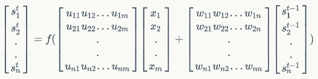
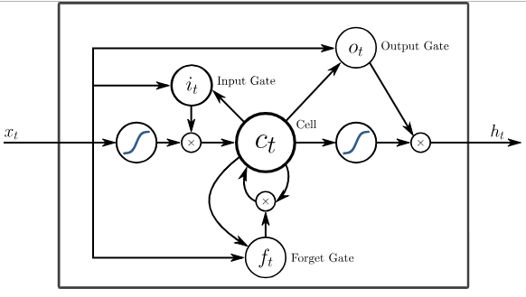
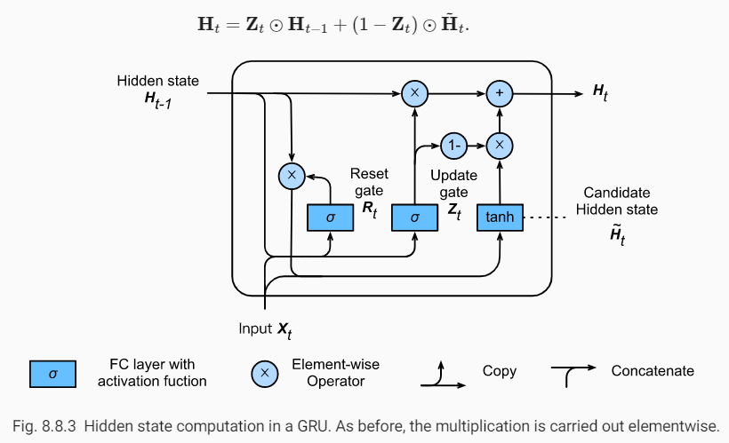
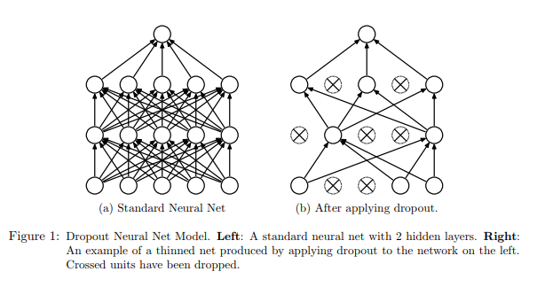

[TOC]

# RNN

## Basic RNN


Figure: A recurrent neural network and the unfolding in time of the computation involved in its forward computation.

$x_t$ is the input at time step $t$. 

$s_t$ is the **hidden state** at time step $t$. It's the "memory" of the network. $s_t$ is calculated with the following formula:

$s_t = f(Ux_t + Ws_{t-1})$

the function $f$ usually is a nonlinearity such as tanh or ReLU.

$o_t$ is the output at time step $t$, which is calculated with the formula:

$o_t = g(Vs_t)$

Given the dimension of matrix U is [n, m], W is [n, n], then:

 

## Long Short-Term Memory (LSTM)

- schematic diagram
  
  - Three gate: Input Gate, Forget Gate and Output Gate.
  
- One input and One output here.
    
  
    

## LSTM cell

LSTM is a **recurrent layer**, while `LSTMCell` is an object **used by LSTM layer** that contains the calculation logic for one step.
A recurrent layer contains a cell object. The cell contains the core code for the calculations of each step, while the recurrent layer commands the cell and performs the actual recurrent calculations.

Usually, people use LSTM layers in their code. Or they use RNN layers containing `LSTMCell`. Both things are almost the same. An LSTM layer is a RNN layer using an `LSTMCell`, as you can check out in the source code.

**About the number of cells**: Although it seems, because of its name, that `LSTMCell` is a single cell, it is actually an object that manages all the units/cells as we may think. In the same code mentioned, you can see that the units argument is used when creating an instance of `LSTMCell`.

## GRU

`kernel_regularizer` & `recurrent_regularizer` & `bias_regularizer` & `activity_regularizer`

[1](https://stackoverflow.com/questions/44495698/keras-difference-between-kernel-and-activity-regularizers)    [2](https://stats.stackexchange.com/questions/383310/difference-between-kernel-bias-and-activity-regulizers-in-keras)

"Here is the answer: I encountered a case where the weights of the net are small and nice, ranging between [-0.3] to [+0.3].
So, I really can't punish them, there is nothing wrong with them. A kernel regularizer is useless. However, the output of the layer is HUGE, in 100's.
Keep in mind that the input to the layer is also small, always less than one. But those small values interact with the weights in such a way that produces those massive outputs. Here I realized that what I need is an activity regularizer, rather than kernel regularizer. With this, I'm punishing the layer for those large outputs, I don't care if the weights themselves are small, I just want to deter it from reaching such state cause this saturates my sigmoid activation and causes tons of other troubles like vanishing gradient and stagnation."

`kernel_regularizer` & `kernel_constraint`

"Constraining the weight matrix directly is another kind of regularization. If you use a simple `L2 regularization` term you penalize high weights with your loss function. With this constraint, you regularize directly. As also linked in the `keras`code, this seems to work especially well in combination with a dropout layer. "

[Dropout: A Simple Way to Prevent Neural Networks from Overfitting](http://www.cs.toronto.edu/~rsalakhu/papers/srivastava14a.pdf)

In chapter 5.1, "One particular form of regularization was found to be especially useful for dropout -- constraining the norm of the incoming weight vector at each hidden unit to be upper bounded by a fixed constant *c*, in other words, if **w** represents the vector of weights incident on any hidden unit, the neural network was optimized under the constraint "

[A Gentle Introduction to Weight Constraints in Deep Learning](https://machinelearningmastery.com/introduction-to-weight-constraints-to-reduce-generalization-error-in-deep-learning/)

"Smaller weights in a neural network can result in a model that is more stable and less likely to overfit the training dataset, in turn having better performance when making a prediction on new data."

"Unlike weight regularization, a weight constraint is a trigger that checks the size or magnitude of the weights and scales them so that they are all below a pre-defined threshold. The constraint forces weights to be small and can be used instead of weight decay and in conjunction with more aggressive network configurations, such as very large learning rates."

[How to Reduce Overfitting Using Weight Constraints in Keras](https://machinelearningmastery.com/how-to-reduce-overfitting-in-deep-neural-networks-with-weight-constraints-in-keras/)




# CNN

## Flatten Layer
`tf.keras.layers.Flatten(data_format=None)`

Flattens the input. Does not affect the batch size.

```python
model = Sequential()
model.add(Conv2D(64, (3, 3),
                 input_shape=(3, 32, 32), padding='same',))
# now: model.output_shape == (None, 64, 32, 32)

model.add(Flatten())
# now: model.output_shape == (None, 65536)
```

## Convolutional Layer


## Pooling Layer

# Batch Normalization

Normalize the activations of the previous layer at each batch, i.e. applies transformation that maintains the mean activation close to 0 while the activation standard deviation close to 1. During training, the layer will keep track of statistics for each input variable and use them to standardize the data.

```python
from tensorflow.keras.layers import BatchNormalization
BatchNormalization(momentum=0.99,
                  center=True,
                  scale=True,
                  trainable=True)
```

Argument "momentum" allows you to control how much of the statistics from the previous mini batch to include when the update is calculated. The standardized output can be scaled using the learned parameters of *Beta* and *Gamma* that define the new mean and standard deviation for the output of the transform. The layer can be configured to control whether these additional parameters will be used or not via the "center" and "scale".

**At the end of training, the mean and standard deviation statistics in the layer at that time will be used to standardize inputs when the model is used to make a prediction.**

Use Before or After the Activation Function? If time and resources permit, it may be worth testing both approaches on your model and use the approach that results in the best performance.

The layer can be added to your model to standardize raw input variables or the outputs of a hidden layer.

Reference: [How to Accelerate Learning of Deep Neural Networks With Batch Normalization](https://machinelearningmastery.com/how-to-accelerate-learning-of-deep-neural-networks-with-batch-normalization/)

# Merge Layer

## concatenate

Functional interface to the `Concatenate` layer, A list of input tensors (at least 2) as input, and then return a tensor which is the concatenation of the inputs alongside axis `axis`.

## add

Functional interface to the `Add` layer, returns a tensor which is the sum of the inputs (at least 2).

```python
    import keras

    input1 = keras.layers.Input(shape=(16,))
    x1 = keras.layers.Dense(8, activation='relu')(input1)
    input2 = keras.layers.Input(shape=(32,))
    x2 = keras.layers.Dense(8, activation='relu')(input2)
    added = keras.layers.add([x1, x2])

    out = keras.layers.Dense(4)(added)
    model = keras.models.Model(inputs=[input1, input2], outputs=out)
```

## multiply

Functional interface to the `Multiply` layer, returns a tensor which is the element-wise product of the inputs (at least 2).

# Core Layer

## Dropout

`tf.keras.layers.Dropout(rate, noise_shape=None, seed=None)`

rate: fraction of the input units to drop.



Using dropout regularization randomly disables some portion of neurons in a hidden layer. In the Keras library, you can add dropout after any hidden layer, and you can specify a dropout rate, which determines the percentage of disabled neurons in the preceding layer. In the original paper that proposed dropout layers, by [Hinton (2012)](https://arxiv.org/pdf/1207.0580.pdf), dropout (with p=0.5) was used on each of the fully connected (dense) layers before the output; it was not used on the convolutional layers. This became the most commonly used configuration.

[A Gentle Introduction to Dropout for Regularizing Deep Neural Networks](https://machinelearningmastery.com/dropout-for-regularizing-deep-neural-networks/)

"We used probability of retention p = 0.8 in the input layers and 0.5 in the hidden layers. Max-norm constraint with c = 4 was used in all the layers."

"It is common for larger networks to more easily overfit the training data. When using dropout regularization, it is possible to use larger networks with less risk of overfitting. A good rule of thumb is to divide the number of nodes in the layer before dropout by the proposed dropout rate and use that as the number of nodes in the new network that uses dropout. For example, a network with 100 nodes and a proposed dropout rate of 0.5 will require 200 nodes (100 / 0.5) when using dropout."

[How to use Dropout with LSTM Networks for Time Series Forecasting](https://machinelearningmastery.com/use-dropout-lstm-networks-time-series-forecasting/)

"It may be worth exploring the combination of both input and recurrent dropout to see if any additional benefit can be provided."

## Lambda

# Embedding Layer

Turns positive integers into dense vectors of fixed size.

```python
  model = Sequential()
  model.add(Embedding(1000, 64, input_length=10))
  # the model will take as input an integer matrix of size (batch,
  input_length).
  # the largest integer (i.e. word index) in the input should be no larger
  than 999 (vocabulary size).
  # now model.output_shape == (None, 10, 64), where None is the batch
  dimension.

  input_array = np.random.randint(1000, size=(32, 10))

  model.compile('rmsprop', 'mse')
  output_array = model.predict(input_array)
  assert output_array.shape == (32, 10, 64)
```


# Language Model

Estimate the probability of word sequence.

+ word sequence: w1, w2, w3, ..., wn
+ P(w1,w2,w3,...,wn)
+ application-1: speech recognition, different word sequences might have the same pronunciation.
+ application-2: sentence generation ...

## Traditional LM -- N-gram

how to estimate P(w1,w2,...,wn)?

+ collect a large amount of text data as training data, but the word sequence w1,w2,...,wn might not appear in the training data.
+ 2-gram LM:
  P(w1,w2,...,wn)=P(w1|START)P(w2|w1)...P(wn|wn-1).
  It is easy to generalize to 3-gram, 4-gram, ...

## NN-based LM